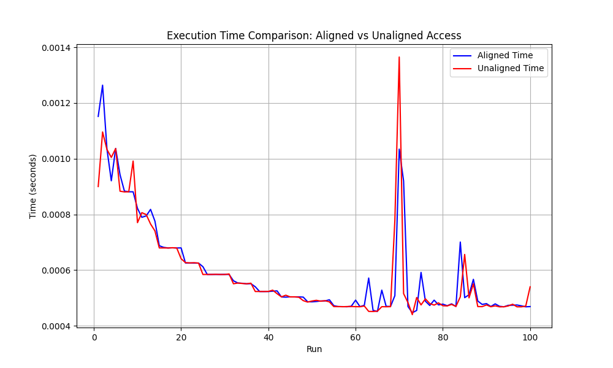

# Performance Benchmark: Aligned vs Unaligned Access

## Build & Run

### Prerequisites:
- **C++ Compiler**: Ensure you have a C++ compiler installed. For example, use `g++` or `clang++`.
- **C++11 or later**: The program uses modern C++ features, so make sure your compiler supports C++11 or newer.
- **For ARM-based systems**: Ensure your system has **Neon** support (most modern ARM processors have this).

### Build Instructions:
1. **Clone the repository**:
   ```bash
   git clone <https://github.com/zgrigoryan/memory_access.git>
   cd <memory_access>
   ```

2. **Compile the C++ program**:
   - For **Linux/macOS** or **x86/x64** systems:
     ```bash
     g++ -O3 -o benchmark main.cpp
     ```
     - This command compiles the `main.cpp` file into an executable named `benchmark`.

3. **Run the program**:
   - Once compiled, run the executable:
     ```bash
     ./benchmark
     ```

4. **View Results**:
   - After running the program, the results will be printed in the terminal. You will also see the `results.csv` file generated with the performance data for both aligned and unaligned memory access.

5. **Visualize Results**:
   - Use the provided Python script to visualize the results:
     ```bash
     python visualize_results.py
     ```

### Cleaning up:
- To clean up the compiled files (if necessary), run:
  ```bash
  rm benchmark
  ```

#### **Problem Overview:**
In this project, we aim to **optimize the performance** of summing an array of **1 million `double` values** using SIMD (Single Instruction, Multiple Data) instructions. SIMD allows the processor to perform the same operation on multiple data elements simultaneously, increasing performance for computationally heavy tasks. Specifically, we are comparing two scenarios:

1. **Aligned Access**: The array is allocated with 8-byte alignment, ensuring that each `double` starts at an 8-byte boundary.
2. **Unaligned Access**: We introduce a slight **misalignment** by adding an offset, causing the `double` values to start at a non-multiple-of-8 address.

Our **goal** is to measure the performance difference in summing the array using SIMD (AVX for x86/x64 and Neon for ARM) and demonstrate how **misalignment** leads to additional memory accesses, slower SIMD loads, and cache inefficiencies.

#### **Expected Results:**
The program should print the aligned and unaligned sums of the array, as well as the time taken for each scenario. Example output:

```
Running aligned access:
Aligned sum: 499904
Function took: 0.000934417 seconds.

Running unaligned access:
Unaligned sum: 499904
Function took: 0.000897167 seconds.
```

#### **Explanation of Results:**
- **Aligned Access**: When the array is **aligned properly** (with a memory boundary that matches the SIMD instruction requirements), SIMD instructions can fetch data efficiently, resulting in **faster memory access** and better **cache utilization**. This reduces the overall execution time.
- **Unaligned Access**: When the array is **misaligned**, the SIMD instructions might need to perform additional memory accesses, leading to slower loads. This causes **increased memory latency** and can reduce the overall performance.

### **Why These Results Occur:**
- **SIMD instructions** (like **AVX** for x86 and **Neon** for ARM) are optimized for **aligned memory** because they allow the processor to load multiple values at once, making use of wide **SIMD registers**.
- **Misalignment** causes the processor to perform additional memory fetches to align the data, resulting in **cache misses** and slower overall performance.

### Results

The performance measurements for aligned and unaligned access are visualized below:



The plot shows the difference in execution time between aligned and unaligned access. In theory misalignment should result in additional memory accesses and slower SIMD loads, demonstrating the impact of memory alignment on processing tasks, however this code shows no significant difference between aligned and misaligned.

### **Architecture-Specific Macros:**

The macros in the code:

```cpp
#if defined(__x86_64__) || defined(_M_X64) || defined(__i386__) || defined(_M_IX86)
    #include <immintrin.h>  // AVX for x86/x64
#elif defined(__aarch64__) || defined(__arm64__)
    #include <arm_neon.h>  // Neon for ARM
#endif
```

These macros are used to determine the **architecture** of the machine on which the code is being compiled. Based on the architecture, the appropriate **SIMD instruction set** is used:
- For **x86/x64** systems (Intel/AMD processors), **AVX** instructions are used for efficient parallel summing.
- For **ARM** systems (such as **Apple Silicon**), **Neon** SIMD instructions are used for parallel processing.

This ensures that the correct **SIMD instructions** are used depending on the hardware, making the code portable and optimized for different architectures.

---